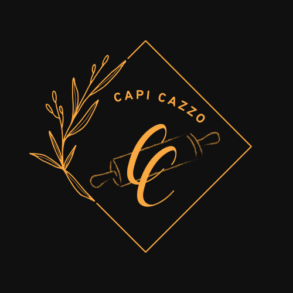

# Capi Cazzo

  
  


<div align="center">
  
</div>


> Este projeto consiste em um aplicativo para restaurante, que inclui as seguintes telas: login, tela principal, catálogo de produtos e carrinho. Os produtos são carregados dinamicamente a partir de um arquivo local no formato JSON. O desenvolvimento foi realizado como parte de uma atividade acadêmica em um curso técnico, e, por isso, a conclusão completa do projeto não é garantida.

### Ajustes e melhorias

O projeto ainda está em desenvolvimento e as próximas atualizações serão voltadas para as seguintes tarefas:

- [ ] Finalização dos produtos no carrinho
- [ ] Arrumar o Adapter dos 'Populares'
- [ ] Trocar para exibir os produtos por meio de um Banco de Dados
- [ ] Fazer uma tela para o produto específico
- [ ] Correção de Bugs e Cores

## 🛠️ Especificações do Ambiente de Desenvolvimento

- **Android Studio**: Koala Feature Drop | 2024.1.2  
  - **Build**: #AI-241.18034.62.2412.12266719, built on August 22, 2024  
  - **Runtime Version**: 17.0.11+0--11852314 amd64  
  - **VM**: OpenJDK 64-Bit Server VM by JetBrains s.r.o.  
- **Sistema Operacional**: Windows 11  
- **GC**: G1 Young Generation, G1 Old Generation  
- **Memória**: 2048 MB  
- **Cores do Processador**: 12  
- **Plugins Instalados**:  
  - One Dark Theme (com.markskelton.one-dark-theme, v5.12.0)  
  - JavaFX Plugin (com.intellij.javafx, v1.0.4)  
  - Rainbow Brackets (com.github.setial, v4.1.2)  
- **Configuração Experimental**: `ide.experimental.ui=true`  

## 💻 Pré-requisitos

Antes de começar, verifique se você atendeu aos seguintes requisitos:  

- Você instalou a versão mais recente do **Android Studio Koala Feature Drop | 2024.1.2**.  
- Você está utilizando uma máquina com **Windows 11** (o suporte para outros sistemas operacionais não foi testado).  
- Você leu a [documentação oficial do Android Studio](https://developer.android.com/studio).  

## 🚀 Como executar o projeto

1. Clone este repositório em sua máquina:  
   ```bash
   git clone <URL_DO_REPOSITÓRIO>

## 🚀 Instalando Capi Cazzo  

Siga as etapas abaixo para instalar o **Capi Cazzo** no seu dispositivo:  

### Windows  
1. Abra o projeto no **Android Studio**.  
2. Aguarde o carregamento completo do projeto.  
3. Certifique-se de que um dispositivo Android está conectado via USB ou que um emulador Android está habilitado e configurado corretamente.  
4. Clique no botão **Run** ou pressione `Shift + F10` para compilar e executar o aplicativo.  

### Android  
1. Baixe o arquivo APK para o seu dispositivo.  
2. No dispositivo, habilite a instalação de aplicativos de fontes desconhecidas em **Configurações > Segurança** (caso ainda não esteja habilitado).  
3. Localize o APK no gerenciador de arquivos do dispositivo.  
4. Toque no arquivo APK e siga as instruções para concluir a instalação.  


## ☕ Usando Capi Cazzo  

Para usar o **Capi Cazzo**, siga estas etapas:  

1. Selecione a quantidade desejada de produtos e adicione-os ao carrinho.  
2. Após escolher todos os produtos, finalize a seleção e acesse a tela do **Carrinho**.  
3. Na tela do carrinho, você poderá:  
   - Verificar o valor total da compra.  
   - Inserir um cupom de desconto, caso tenha um.  

### Cupons disponíveis  
- **VALE15**: 15% de desconto.  
- **VALE20**: 20% de desconto.  
- **VALE50**: 50% de desconto.  

Aproveite sua experiência com o **Capi Cazzo**!  


# Preview:
  
 
 
 
 
 

 

## 📝 Licença

Esse projeto está sob licença. Veja o arquivo [LICENÇA](LICENSE.md) para mais detalhes.
